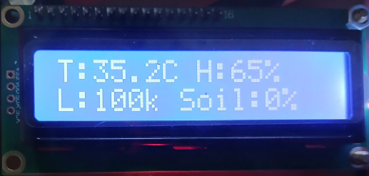
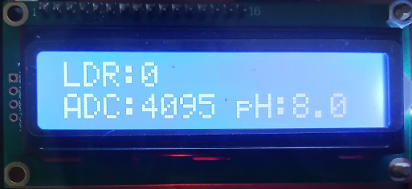
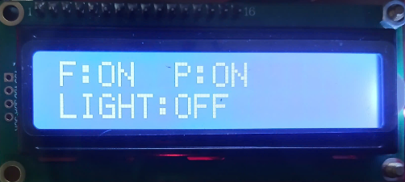
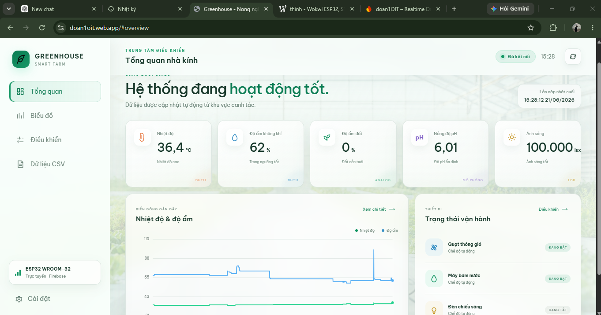
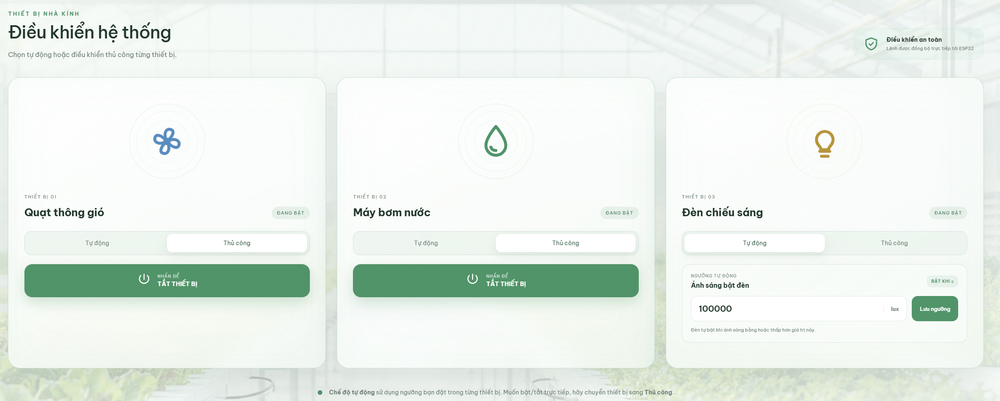
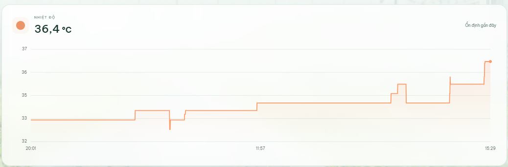
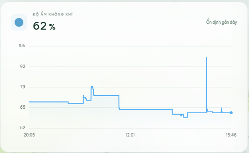
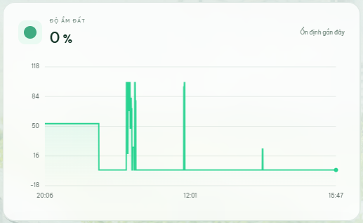
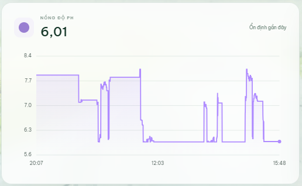
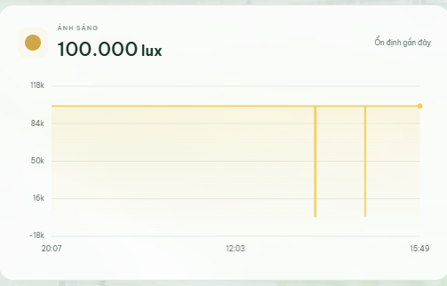

# IoT Plant Care Monitoring System

An ESP32-based IoT prototype for monitoring and supporting small-scale plant
care. The system reads environmental data from sensors, publishes measurements
to Firebase Realtime Database, displays local status on an LCD, and lets users
monitor or control actuators from a web dashboard.

This public README was rewritten from the project report for GitHub publishing.
The original Word/PDF report, cover pages, personal information, WiFi
credentials, Firebase project URLs, API keys, and private configuration files
are intentionally excluded.

> Hardware note: the report mentions DHT22 in the objective section, but the
> implemented wiring table, component images, test section, and final prototype
> use DHT11. This README documents the implemented DHT11 version.

## Repository Structure

```text
smart-plant-care-iot/
|-- docs/
|   `-- README.md         # Vietnamese system design notes
|-- images/               # Public technical images used in README/report
|-- report/
|   `-- report.md         # Vietnamese public project report
|-- results/
|   `-- README.md         # Vietnamese test results and evaluation
|-- source/
|   `-- README.md         # Vietnamese source-code guide
|-- .gitignore            # Prevents private reports, credentials, and temp data
`-- README.md             # Main English project description
```

## Project Goals

- Build a small IoT plant monitoring and care prototype.
- Use ESP32 as the main controller and WiFi-enabled IoT gateway.
- Read temperature, air humidity, soil moisture, light condition, and simulated
  pH data.
- Send sensor data to Firebase Realtime Database.
- Display live measurements and actuator status on a dashboard.
- Support both automatic threshold-based control and manual dashboard control.
- Evaluate the system through functional tests and a long-running monitoring
  scenario.

## Scope

| Item | Description |
|---|---|
| Target use case | Indoor plant pots, small garden models, and educational IoT demos |
| Controller | ESP32 with built-in WiFi |
| Sensors | DHT11, LDR module, soil moisture sensor, simulated pH value |
| Cloud backend | Firebase Realtime Database |
| User interface | Web dashboard with cards, charts, controls, and CSV/data table |
| Actuators | Cooling fan, mini water pump, LED grow light |
| Local display | 16x2 I2C LCD |
| Project level | Prototype for learning and experimentation, not industrial agriculture |

## System Architecture

The system is organized into six main blocks:

- **Sensor block:** collects temperature, air humidity, soil moisture, light,
  and simulated pH values.
- **Processing block:** ESP32 reads sensor values, converts raw signals,
  compares values with thresholds, and controls output pins.
- **Communication block:** ESP32 connects to WiFi and exchanges data with
  Firebase.
- **Database block:** Firebase stores sensor values, manual commands, actuator
  status, thresholds, and Auto/Manual mode flags.
- **Monitoring block:** the dashboard reads Firebase data and displays cards,
  charts, tables, and control widgets.
- **Actuator block:** relays switch the fan, pump, and light according to ESP32
  decisions.


The system uses a two-way data flow:

1. ESP32 reads environmental sensors.
2. Values are shown locally on the LCD.
3. ESP32 publishes new values to Firebase.
4. The dashboard listens to Firebase and updates the user interface.
5. The user changes operating mode, thresholds, or manual commands.
6. ESP32 reads the updated Firebase values and drives relays.
7. ESP32 writes actual actuator status back to Firebase.


## Hardware Components

| Component | Role |
|---|---|
| ESP32 | Main controller, WiFi gateway, Firebase client, relay controller |
| DHT11 | Measures ambient temperature and air humidity |
| LDR module | Detects bright/dark light condition |
| Soil moisture sensor | Reads analog soil moisture level and converts it to percentage |
| 16x2 I2C LCD | Displays connection state, sensor values, and actuator status |
| Relay module | Switches external loads from ESP32 digital outputs |
| Cooling fan | Turns on when temperature is above the configured threshold |
| Mini water pump | Waters the plant when soil moisture is below threshold |
| LED light | Turns on when the environment is too dark |


## ESP32 Pin Mapping

| No. | Device / Module | Signal pin | ESP32 pin | Signal type | Function |
|---:|---|---|---|---|---|
| 1 | DHT11 sensor | DATA | GPIO23 | Digital Input | Read temperature and air humidity |
| 2 | LDR module | DO | GPIO34 | Digital Input | Read bright/dark state |
| 3 | Soil moisture sensor | AO | GPIO35 | Analog Input | Read soil moisture ADC value |
| 4 | Cooling fan relay | IN | GPIO26 | Digital Output | Turn fan on/off |
| 5 | Water pump relay | IN | GPIO27 | Digital Output | Turn pump on/off |
| 6 | LED light relay | IN | GPIO17 | Digital Output | Turn light on/off |
| 7 | I2C LCD | SDA | GPIO21 | I2C Data | Send LCD data |
| 8 | I2C LCD | SCL | GPIO22 | I2C Clock | Provide I2C clock |

## Automatic Control Thresholds

| Actuator | Automatic trigger | Threshold | Meaning |
|---|---|---:|---|
| Fan | Temperature is greater than or equal to threshold | 32 deg C | Cool the environment when it is hot |
| Pump | Soil moisture is less than or equal to threshold | 40% | Water the plant when soil is dry |
| Light | Light level is less than or equal to threshold | 500 lux | Provide light when the environment is dark |

In **Auto** mode, ESP32 decides the actuator state from sensor values and
thresholds. In **Manual** mode, dashboard commands take priority so the user can
directly test or override each device.

## Firmware Design

The ESP32 firmware is structured as repeated periodic tasks. Each task has its
own interval so the system can read sensors, synchronize Firebase, refresh the
LCD, and handle commands without blocking the main loop for too long.

| Task | Period | Description |
|---|---:|---|
| Read sensors | 2000 ms | Read DHT11, LDR, soil moisture, and simulated pH |
| Read Firebase controls | 1000 ms | Update Auto/Manual mode, thresholds, and manual commands |
| Send Firebase data | 3000 ms | Publish temperature, humidity, light, soil moisture, and pH |
| Rotate LCD page | 4000 ms | Change the displayed LCD page |


Main firmware loop:

```text
Initialize LCD, GPIO, WiFi, and Firebase
        |
        v
Read DHT11, LDR, soil moisture sensor, and simulated pH
        |
        v
Process and convert sensor values
        |
        v
Publish new values to Firebase
        |
        v
Read Auto/Manual mode, thresholds, and commands
        |
        v
Auto mode: compare sensor values with thresholds
Manual mode: apply dashboard commands
        |
        v
Update relays, LCD, Firebase status, and dashboard
```

## LCD Display

The 16x2 I2C LCD provides quick local feedback when the dashboard is not open.
It rotates through connection state, sensor values, ADC/pH data, and actuator
status.







## Firebase Data Model

Firebase is used as the shared state layer between ESP32 and the dashboard.
ESP32 publishes sensor values and actual actuator status, while the dashboard
writes user commands and threshold settings.

| Branch | Main fields | Purpose |
|---|---|---|
| `sensor` | `temp`, `hum`, `lux`, `soil_adc`, `soil_percent`, `ph` | Current sensor values |
| `control` | `fan`, `pump`, `light` | Manual on/off commands from dashboard |
| `status` | `fan`, `pump`, `light` | Actual actuator state reported by ESP32 |
| `threshold` | `temp`, `soil`, `light` | Thresholds for automatic control |
| `mode` | `fan_auto`, `pump_auto`, `light_auto` | Auto/Manual mode flags |


For a public repository, keep the real Firebase database URL, API key,
authentication token, service account file, WiFi SSID, and WiFi password out of
Git.

## Dashboard

The web dashboard provides remote monitoring and control. It includes:

- Sensor cards for temperature, humidity, soil moisture, pH, and light.
- Time-series charts for long-running observation.
- Control panels for fan, pump, and light.
- Auto/Manual mode controls for each actuator.
- CSV/data table area for reviewing logged measurements.
- Connection/status indicators so users can confirm that data is updating.





## Control Logic

### Automatic Mode

In automatic mode, ESP32 compares sensor data against configured thresholds:

- If temperature is `>= 32 deg C`, the fan turns on.
- If soil moisture is `<= 40%`, the pump turns on.
- If light level is `<= 500 lux`, the LED light turns on.

### Manual Mode

In manual mode, the dashboard writes commands to Firebase under the `control`
branch. ESP32 reads these values and updates the corresponding relay outputs.
This mode is useful for debugging, device testing, and direct user intervention.

### Status Feedback

After changing relay outputs, ESP32 writes actual device states back to the
`status` branch. This prevents the dashboard from showing only a desired command
without knowing whether ESP32 has processed it.

## Functional Testing

### Startup Test

| No. | Test item | Observed result | Status |
|---:|---|---|---|
| 1 | Power on the system | ESP32 runs and modules receive signals | Passed |
| 2 | Connect to WiFi | LCD shows `WiFi OK` | Passed |
| 3 | Connect to Firebase | LCD shows `Firebase HTTP` | Passed |
| 4 | Start LCD display | LCD shows the expected pages | Passed |

### Sensor Test

| No. | Sensor | Test content | Result |
|---:|---|---|---|
| 1 | DHT11 | Read temperature and humidity | Data was read successfully |
| 2 | LDR | Detect bright/dark state | Worked correctly |
| 3 | Soil moisture sensor | Read ADC and convert to percentage | Worked correctly |
| 4 | Simulated pH | Generate pH value within configured range | Displayed successfully |

### Actuator Test

| No. | Device | Test condition | Result |
|---:|---|---|---|
| 1 | Cooling fan | Temperature exceeds threshold | Fan turns on |
| 2 | Water pump | Soil moisture is below threshold | Pump turns on |
| 3 | LED light | Environment is too dark | Light turns on |
| 4 | Manual control | State is changed from Firebase/dashboard | Device responds correctly |

## Long-Running Test Scenario

| Phase | Time | Activity | Expected result | Evaluation method |
|---|---|---|---|---|
| 1 | 20:00 - 20:10 | Power on ESP32 and verify WiFi | LCD shows connection, dashboard receives data | Observe LCD and dashboard |
| 2 | 20:10 - 23:00 | Let the system stabilize | Sensor data starts appearing on charts | Observe chart lines |
| 3 | 23:00 - 11:58 | Keep the system running continuously | Dashboard keeps updating without long-term data loss | Track timeline data |
| 4 | 11:58 - 15:30 | Observe environmental changes | Sensor values change and remain synchronized | Compare chart shapes |
| 5 | End of test | Summarize final values and control behavior | Actuator states match thresholds | Compare values with thresholds |

## Experimental Results

| No. | Parameter | Final observed value | Related threshold | Interpretation | Status |
|---:|---|---:|---:|---|---|
| 1 | Temperature | 36.4 deg C | 32 deg C | Above threshold, fan should turn on | Passed |
| 2 | Air humidity | 62% | Not applied | Stable with slight fluctuation | Passed |
| 3 | Soil moisture | 0% | 40% | Dry soil, pump should turn on | Passed |
| 4 | pH | 6.01 | Not applied | Simulated pH displayed correctly | Passed |
| 5 | Light | 100,000 lux | 500 lux | Bright enough, light should stay off | Passed |
| 6 | Dashboard | Charts available | Not applied | Data updated and logged over time | Passed |
| 7 | Firebase | Periodic updates | Not applied | ESP32 published data stably | Passed |

Automatic control evaluation from the final observed values:

| Device | Input data | Condition | Expected state | Status |
|---|---|---|---|---|
| Cooling fan | Temperature 36.4 deg C | `>= 32 deg C` | Fan on | Passed |
| Water pump | Soil moisture 0% | `<= 40%` | Pump on | Passed |
| LED light | Light 100,000 lux | `> 500 lux` | Light off | Passed |

## Test Charts











## Strengths

- ESP32 provides both processing and WiFi connectivity without an extra network
  module.
- The system has a clear sensor-controller-cloud-dashboard-actuator structure.
- LCD and dashboard views make the system easy to inspect locally and remotely.
- Auto and Manual modes make the prototype flexible for both daily operation and
  testing.
- Firebase allows quick real-time synchronization between ESP32 and the
  dashboard.
- The design is suitable for learning IoT, embedded programming, cloud data
  synchronization, and actuator control.

## Limitations

- DHT11 is suitable for basic demonstrations but has limited measurement
  accuracy.
- The LDR is read as a digital bright/dark signal, so the displayed lux value is
  only an approximation.
- Soil moisture values can fluctuate because of sensor placement, soil contact,
  and analog noise.
- pH is simulated in software and is not measured from a real pH probe.
- The dashboard depends on WiFi and Firebase availability.
- The hardware is still a prototype and needs better enclosure, cable
  management, power protection, and water safety before real deployment.

## Future Improvements

- Replace DHT11 with DHT22, SHT30, or BME280 for better accuracy.
- Replace the LDR with a BH1750 or another calibrated lux sensor.
- Use a capacitive soil moisture sensor to improve durability in wet soil.
- Add a real pH sensor and calibrate it with standard buffer solutions.
- Add alerts through email, phone notification, or messaging apps.
- Support multiple plant pots or multiple growing zones in one dashboard.
- Add offline fallback so ESP32 can keep controlling actuators when Internet is
  unavailable.
- Consider MQTT for lightweight communication in larger IoT deployments.
- Design a PCB and protective enclosure for a cleaner and safer prototype.
- Use historical data to recommend plant-specific thresholds.

## Public GitHub Notes

Do not commit:

- Original Word, PDF, or PowerPoint reports if they contain personal details.
- Screenshots containing WiFi passwords, Firebase URLs, API keys, or tokens.
- `.env` files, service account JSON files, or real configuration headers.
- Private test data or credentials.

Recommended public files:

- Edited English README/report content.
- Technical images with private information removed.
- Source code with credentials replaced by example config files.
- `config.example.h`, `.env.example`, or similar setup templates.

## Conclusion

The project successfully demonstrates a basic IoT plant care model using ESP32,
environmental sensors, Firebase Realtime Database, a web dashboard, LCD display,
and relay-controlled actuators. During testing, the system read environmental
data, displayed local status, synchronized values to Firebase, and controlled
fan, pump, and light according to configured thresholds.

The current version is suitable for coursework, demonstration, and further
development. Future work should focus on more accurate sensors, real pH
measurement, alerting, offline operation, MQTT support, PCB design, enclosure
improvements, and smarter threshold recommendations based on historical data.
