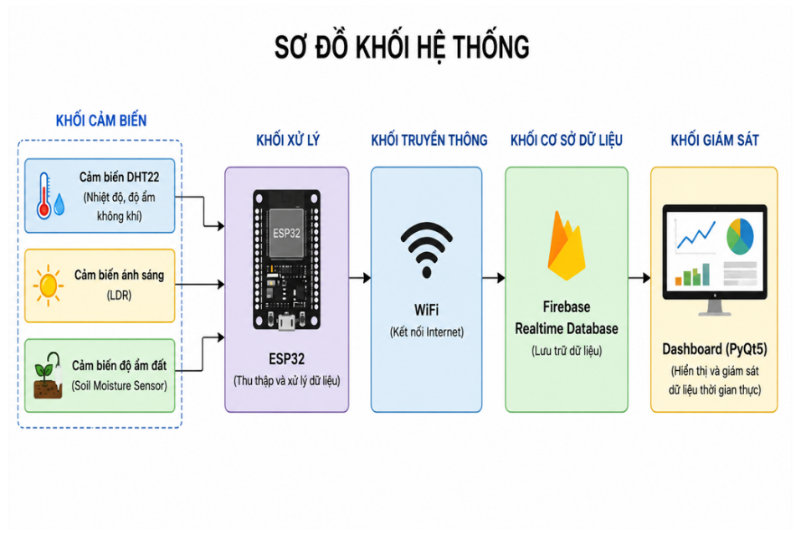
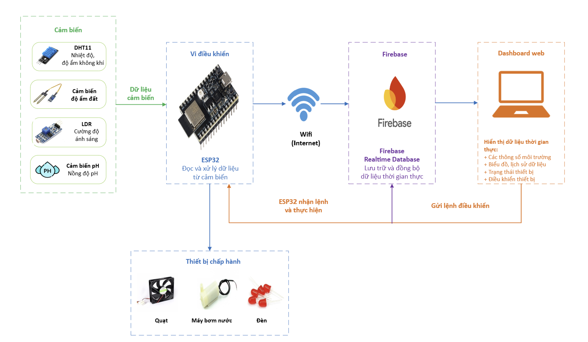
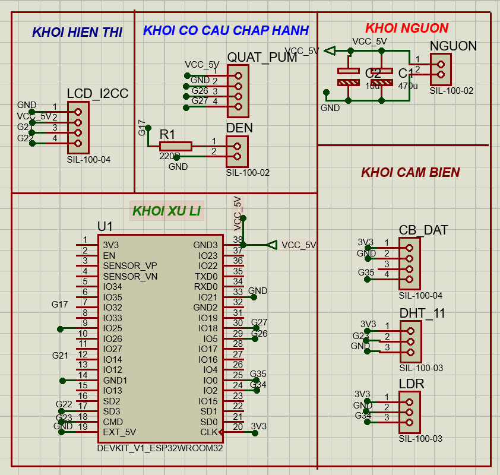
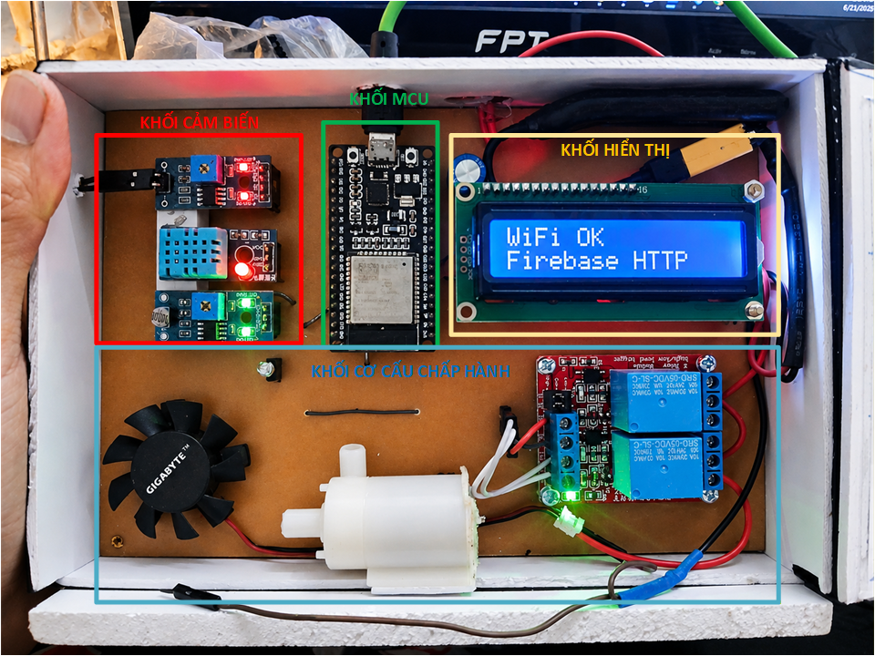
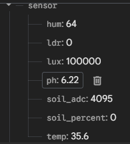
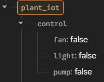
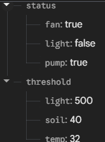
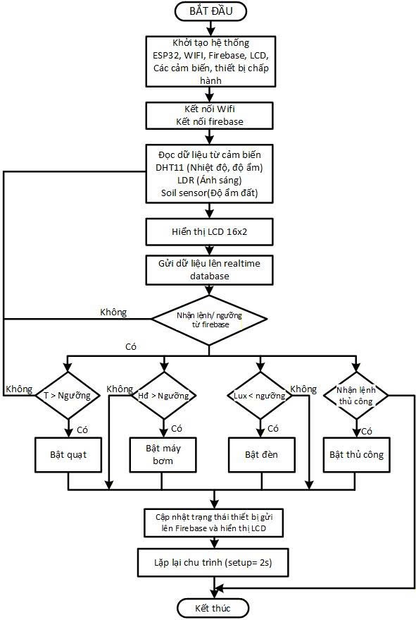

# Tài Liệu Thiết Kế Hệ Thống

Thư mục này mô tả phần thiết kế kỹ thuật của hệ thống IoT chăm sóc cây trồng:
kiến trúc tổng thể, phần cứng, luồng dữ liệu, cấu trúc Firebase, thuật toán điều
khiển và nguyên tắc bảo mật khi đưa mã nguồn lên GitHub public.

## Tổng Quan Thiết Kế

Hệ thống được xây dựng theo mô hình IoT cơ bản gồm cảm biến, vi điều khiển,
kết nối Internet, cơ sở dữ liệu thời gian thực, dashboard giám sát và thiết bị
chấp hành. ESP32 đóng vai trò trung tâm: đọc dữ liệu cảm biến, xử lý logic,
đồng bộ với Firebase và điều khiển relay.

Các khối chính:

- **Khối cảm biến:** DHT11, LDR, cảm biến độ ẩm đất và giá trị pH mô phỏng.
- **Khối xử lý:** ESP32 đọc dữ liệu, chuyển đổi giá trị và quyết định điều
  khiển.
- **Khối truyền thông:** WiFi của ESP32 giúp gửi/nhận dữ liệu qua Internet.
- **Khối dữ liệu:** Firebase Realtime Database lưu giá trị cảm biến, ngưỡng,
  chế độ và trạng thái thiết bị.
- **Khối giao diện:** Dashboard hiển thị số liệu, biểu đồ và nút điều khiển.
- **Khối chấp hành:** relay điều khiển quạt, máy bơm và đèn.

## Luồng Dữ Liệu

Luồng hoạt động được tổ chức hai chiều:

1. ESP32 đọc cảm biến môi trường theo chu kỳ.
2. Dữ liệu được xử lý và hiển thị tại chỗ trên LCD.
3. ESP32 gửi dữ liệu lên Firebase.
4. Dashboard lắng nghe thay đổi dữ liệu và cập nhật giao diện.
5. Người dùng thay đổi chế độ, ngưỡng hoặc lệnh thủ công.
6. ESP32 đọc lại lệnh từ Firebase và cập nhật relay.
7. Trạng thái thực tế của thiết bị được gửi ngược lên Firebase.

Thiết kế này giúp dashboard không giao tiếp trực tiếp với ESP32. Firebase đóng
vai trò trung gian, làm hệ thống dễ mở rộng và dễ quan sát trong quá trình kiểm
thử.

## Thiết Kế Phần Cứng

| Thành phần | Vai trò |
|---|---|
| ESP32 | Bộ điều khiển trung tâm, kết nối WiFi, xử lý dữ liệu và điều khiển relay |
| DHT11 | Đo nhiệt độ và độ ẩm không khí |
| LDR | Nhận biết môi trường sáng/tối |
| Cảm biến độ ẩm đất | Đo độ ẩm đất thông qua tín hiệu analog |
| LCD I2C 16x2 | Hiển thị trạng thái kết nối, cảm biến và thiết bị |
| Relay | Đóng/ngắt tải chấp hành |
| Quạt | Làm mát khi nhiệt độ cao |
| Máy bơm | Tưới nước khi đất khô |
| Đèn LED | Bổ sung ánh sáng khi môi trường thiếu sáng |

## Bảng Chân ESP32

| Thiết bị / Module | Chân tín hiệu | Chân ESP32 | Kiểu tín hiệu | Chức năng |
|---|---|---|---|---|
| DHT11 | DATA | GPIO23 | Digital Input | Đọc nhiệt độ và độ ẩm không khí |
| LDR | DO | GPIO34 | Digital Input | Nhận biết sáng/tối |
| Cảm biến độ ẩm đất | AO | GPIO35 | Analog Input | Đọc ADC độ ẩm đất |
| Relay quạt | IN | GPIO26 | Digital Output | Bật/tắt quạt |
| Relay bơm | IN | GPIO27 | Digital Output | Bật/tắt máy bơm |
| Relay đèn | IN | GPIO17 | Digital Output | Bật/tắt đèn |
| LCD I2C | SDA | GPIO21 | I2C Data | Truyền dữ liệu LCD |
| LCD I2C | SCL | GPIO22 | I2C Clock | Xung clock I2C |

## Thiết Kế Firebase

Firebase được tổ chức thành các nhánh dữ liệu riêng để ESP32 và dashboard đọc
ghi rõ ràng.

| Nhánh | Trường dữ liệu | Mục đích |
|---|---|---|
| `sensor` | `temp`, `hum`, `lux`, `soil_adc`, `soil_percent`, `ph` | Lưu giá trị cảm biến hiện tại |
| `control` | `fan`, `pump`, `light` | Lệnh điều khiển thủ công từ dashboard |
| `status` | `fan`, `pump`, `light` | Trạng thái thực tế do ESP32 cập nhật |
| `threshold` | `temp`, `soil`, `light` | Ngưỡng điều khiển tự động |
| `mode` | `fan_auto`, `pump_auto`, `light_auto` | Cờ chọn Auto/Manual |

## Thuật Toán Điều Khiển

Trong chế độ tự động, ESP32 so sánh dữ liệu cảm biến với ngưỡng:

- Nhiệt độ `>= 32°C`: bật quạt.
- Độ ẩm đất `<= 40%`: bật máy bơm.
- Ánh sáng `<= 500 lux`: bật đèn.

Trong chế độ thủ công, dashboard ghi lệnh vào nhánh `control`, ESP32 đọc lệnh
và điều khiển relay tương ứng. Sau mỗi lần điều khiển, ESP32 cập nhật lại nhánh
`status` để dashboard hiển thị trạng thái thực tế.

## Chu Kỳ Xử Lý

| Tác vụ | Chu kỳ | Mô tả |
|---|---:|---|
| Đọc cảm biến | 2000 ms | Đọc DHT11, LDR, độ ẩm đất và pH mô phỏng |
| Đọc Firebase | 1000 ms | Cập nhật chế độ, ngưỡng và lệnh điều khiển |
| Gửi Firebase | 3000 ms | Gửi dữ liệu cảm biến lên cloud |
| Chuyển trang LCD | 4000 ms | Luân phiên nội dung hiển thị |

## Nguyên Tắc Public Repository

Khi đưa lên GitHub public, chỉ nên đưa các tài liệu đã biên tập và hình ảnh kỹ
thuật cần thiết. Không đưa các file chứa thông tin riêng tư như Word/PDF gốc,
WiFi password, Firebase URL thật, API key, token hoặc service account JSON.

